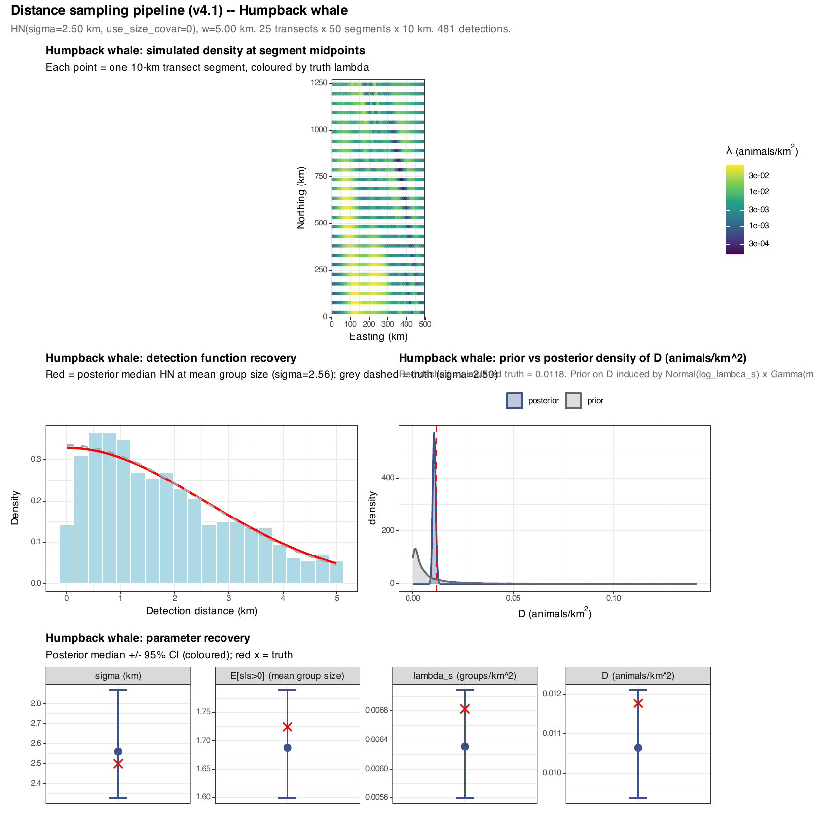
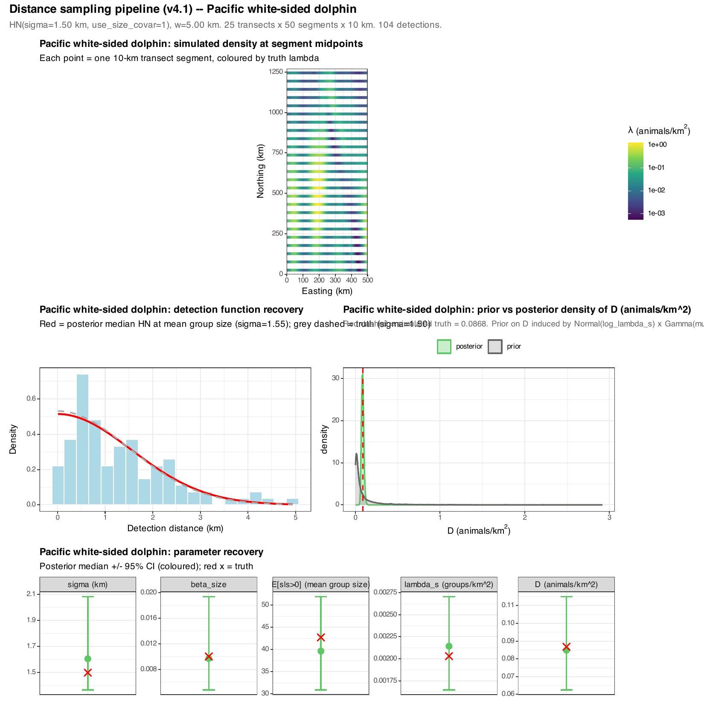

```{r setup, include=FALSE}
knitr::opts_chunk$set(
  echo    = FALSE,
  message = FALSE,
  warning = FALSE,
  fig.align = "center"
)
# All paths in this notebook resolve relative to the .qmd's own
# directory (outputs/distance_v4.1/). Diagnostic PDFs live in this
# folder; the per-species single-page renders for the notebook are in
# `_notebook_figs/`.
```

# Background

eDNA gives us **species occurrence + concentration** at the bottle, but it doesn't directly count animals. Visual line-transect surveys give us **counts of detected groups + group sizes + perpendicular distances**, which through a detection-function model translate to **animal density**. Pairing the two observation processes — eDNA on the same survey effort that produces the visual data — is the long-term goal for the joint model.

This notebook documents a **stand-alone test pipeline** for the line-transect side, building up from a one-line "fit Distance to simulated data" prototype to a model that:

1. **simulates** a spatially structured underlying density field (matching the v4.1 GP),
2. **divides** by species-specific group sizes to get a group-density field,
3. **simulates sightings** along E-W transects via a half-normal detection function (with a group-size covariate where appropriate),
4. **fits** a single-species, *non-spatial* Stan distance model that recovers `σ_det`, mean group size, group density, and animal density.

It's developed across four PRs ([#34](https://github.com/MMARINeDNA/eDNAVisualJointModel/pull/34) → [#37](https://github.com/MMARINeDNA/eDNAVisualJointModel/pull/37)). Each PR fixed the bias surfaced by the previous run's diagnostics. By the end:

- All sampler diagnostics clean (0 divergences, no max-treedepth, R-hat satisfactory).
- All parameters with non-NA truth (σ, β_size, mean group size, λ, D) covered by the posterior 95% CI for both species.

# The pipeline

::: {.callout-note}
- Pipeline script: `distance/00_distance_v4.1.R`
- Stan model: `distance/distance_hn_dens_v4.1.stan` (built on top of `distance/distance_hn_dens.stan` from the project's existing Distance work)
- Outputs: `outputs/distance_v4.1/`
:::

## Domain and survey design

Same domain as v4.1: UTM Zone 10N, San Francisco (37.77°N) to the US/Canada border (~49°N), 500 km × 1270 km. Same rotated bathymetry — the shelf-slope axis tilted 25° in normalised coordinates so isobaths run NW–SE.

**Survey design** (final form):

- **25 systematic E–W transects**, offset by half-spacing from each edge, spanning the full 500 km E–W domain.
- **10 km segments** → 50 segments per transect → 1250 segments total, **12,500 km total effort**.
- **Strip half-width `w = 5 km`**, so surveyed area ≈ 125,000 km² (20% of the domain).

E-W (rather than N-S) was a [user-direction during PR #34](https://github.com/MMARINeDNA/eDNAVisualJointModel/pull/34) — perpendicular to the shelf-slope axis matches the typical real-world survey pattern for this coast.

## Simulation

Per species, the script:

1. Draws a zero-mean GP density surface at segment midpoints using the v4.1 species-specific hyperparameters
   $$
   \log \lambda_{\text{animals}}(\mathbf{x}_i) = \mu_s + f_s(\mathbf{x}_i),
   \qquad f_s \sim \mathcal{GP}(0, K_s).
   $$
2. Converts to group density `λ_groups = λ_animals / mean_group_size_s`.
3. For each segment $i$, draws `n_strip ~ Poisson(λ_groups · 2w · L_seg)` groups in the strip.
4. Each group's perpendicular distance is drawn `Uniform(0, w)`; group sizes are drawn from the species' empirical pool (see [§2.3](#sec-empirical-sizes)); detection is half-normal:
   $$
   p_{\text{det}}(x \mid s) = \exp\!\Bigl( -\tfrac{x^2}{2\,\sigma(s)^2} \Bigr),
   \qquad
   \log \sigma(s) = \log \sigma_0 + \beta_{\text{size}} \cdot (s - s_{\text{centre}}).
   $$

Humpback uses a constant detection function (`use_size_covar = 0`); PWSD has `β_size = 0.01` per individual on `log(σ)` so larger groups are more detectable.

## Empirical group-size pools {#sec-empirical-sizes}

Group sizes are drawn (with replacement) from the empirical pools assembled by `scripts/getGrpSz.R` from `Data/sightings.csv`:

| species | n | mean | median | range |
|---|---|---|---|---|
| Humpback | 683 | 1.72 | 1 | [1, 8] |
| PWSD | 110 | 42.75 | 21 | [2, 452] |

PWSD's right tail is exactly 10 sd above the mean — a heavy enough tail that the choice of group-size sub-model matters (see [§3.4](#sec-pwsd-lognormal)).

## The Stan model — final form

The line-transect Stan model lives in `distance/distance_hn_dens_v4.1.stan`. After the four PRs, it has the structure below.

### Detection function

Per-observation HN scale parameter, with an optional group-size covariate:
$$
\log \sigma_i = \log \sigma_0 + \beta_{\text{size}} \cdot (s_i - s_{\text{centre}}),
\qquad
\sigma_i = \exp(\log \sigma_i).
$$

Per-observation effective strip half-width:
$$
\mathrm{ESW}_i = \sigma_i \sqrt{\tfrac{\pi}{2}} \cdot \mathrm{erf}\!\bigl(\,w / (\sigma_i \sqrt{2})\,\bigr).
$$

Per-observation density of distance given detection (truncated half-normal):
$$
\mathrm{target} \mathrel{+}= -\frac{x_i^2}{2 \sigma_i^2} - \log \mathrm{ESW}_i.
$$

### Group-size sub-model

A flag `group_size_dist` selects between two distributions:

- **Zero-truncated NB(μ_s, φ_s)** for humpback (its empirical max is 8; NB fits fine).
- **Log-normal(μ_log, σ_log)** for PWSD (handles the heavy right tail; see [§3.4](#sec-pwsd-lognormal)).

Both NB and log-normal parameter blocks are always sampled; only the matching one enters the data likelihood.

### Encounter rate

Per segment, observed group counts follow Poisson:
$$
\mathrm{seg\_count}_i \sim \mathrm{Poisson}(\,\lambda_s \cdot L_i \cdot 2 \cdot \overline{\mathrm{ESW}}_{\!\text{pop}}\,),
$$

where `λ_s` is the population group density (a single scalar — the model is non-spatial), `L_i` is the segment length, and **`ESW_pop` is the population-corrected ESW averaged over the population group-size distribution**:
$$
\overline{\mathrm{ESW}}_{\!\text{pop}} = \frac{\sum_{k=1}^{S_{\max}} P(s = k)\,\mathrm{ESW}(\sigma(k))}{\sum_{k=1}^{S_{\max}} P(s = k)}.
$$

Here `P(s = k)` is the group-size pmf — zero-truncated NB if `group_size_dist = 0`, rounded-bin log-normal if `group_size_dist = 1`. The integration is done as a discrete sum to `S_max` (50 for humpback, 1000 for PWSD).

### Group-size likelihood with size-bias correction

Observed group sizes come from the **detected** sample, which is size-biased when detection probability depends on size. Conditioning on detection,
$$
f(s \mid \text{detected}) \propto f_{\text{pop}}(s) \cdot p_{\text{det}}(s),
$$
so
$$
\log f(s_i \mid \text{detected}) = \log f_{\text{pop}}(s_i) + \log \mathrm{ESW}_i - \log \overline{\mathrm{ESW}}_{\!\text{pop}}.
$$
The Stan code adds the per-observation `+ log(ESW_i) - log(ESW_pop)` correction to the population group-size likelihood.

### Fixed and sampled

| Parameter | Sampled? | Notes |
|---|---|---|
| `log_sigma` | yes | log-scale of HN at `s = s_centre` |
| `beta_size` | yes | log-scale slope on `(s − s_centre)`; tightly pinned at 0 by prior when not used |
| `mu_s, phi_s` | yes | NB sub-model; unused when `group_size_dist = 1` |
| `mu_log_s, sigma_log_s` | yes | LN sub-model; unused when `group_size_dist = 0` |
| `log_lambda_s` | yes | log group density (per-species prior, [§3.2](#sec-priors-data)) |
| `S_max`, `w`, prior hyperparameters | data | per-species values supplied from R |

# The four PRs

The Stan model and R pipeline got there incrementally. Each PR's diagnostic from the previous run pointed at the next thing to fix.

## PR #34 — first pipeline

[**PR #34**](https://github.com/MMARINeDNA/eDNAVisualJointModel/pull/34) was the initial implementation: spatial GP density → group density → systematic transects → HN detection → Stan fit.

Constants in this version:

- Single shared `σ_det = 2 km` for both species (no group-size covariate).
- All groups assigned the species mean (humpback = 2, PWSD = 50, both constants).
- `log_lambda_s ~ Normal(−8, 2)` hardcoded inside the Stan model.

Recovery was *passable* (all CIs covered truth) but uninteresting because the group-size covariate, real group-size variability, and per-species priors weren't in play yet.

## PR #35 — per-species detection function and data-supplied priors {#sec-priors-data}

[**PR #35**](https://github.com/MMARINeDNA/eDNAVisualJointModel/pull/35) made three additions:

1. **Each species gets its own `σ_det`.** Humpback = 2.5 km (large, conspicuous); PWSD = 1.5 km at `s_centre = 50` (smaller animals, but groups are big and conspicuous).
2. **PWSD adds a group-size covariate**: `log(σ_g) = log(σ_0) + β_size · (s_g − s_centre)`, with `β_size = 0.01` per individual. To make this identifiable, PWSD groups in the simulation got drawn from a synthetic NB(50, size=5) zero-truncated. Humpback stayed at constant size 2.
3. **`log_lambda_s` and group-size NB priors moved to data**, with **per-species values**. Critical because `Gamma(2, 0.02)` (mean 100) was wildly inappropriate for humpback's true mean ≈ 2.

After this PR, all parameters with non-NA truth covered the posterior 95% CI under the synthetic-group-size data.

## PR #36 — Population-corrected ESW + size-bias corrections + real group sizes + new seed

[**PR #36**](https://github.com/MMARINeDNA/eDNAVisualJointModel/pull/36) was the largest single change. Three fixes plus a switch to real data:

### 3.3.1 Population-corrected ESW in the encounter rate

The encounter-rate Poisson previously used `ESW(σ(μ_s))` — the population mean group size plugged into the detection function. But `σ(s) = exp(log σ + β · (s − s_centre))` is convex in `s`, so `E[ESW(σ(s))] > ESW(σ(E[s]))`. Using `ESW(σ(μ_s))` *under-estimates* the true mean ESW and inflates `λ_s` to compensate.

The fix is to numerically integrate `ESW(σ(s))` over the population group-size distribution:

```stan
real esw_pop = 0; real p_sum = 0;
for (k in 1:S_max) {
  real pk      = exp(neg_binomial_2_lpmf(k | mu_s, phi_s));
  real sigma_k = exp(log_sigma + beta_size * (k - s_centre));
  real esw_k   = sigma_k * sqrt(pi()/2) * erf(w / (sqrt(2)*sigma_k));
  esw_pop += pk * esw_k;
  p_sum   += pk;
}
esw_pop /= p_sum;
target += poisson_lpmf(seg_count | lambda_s * seg_l * 2 * esw_pop);
```

### 3.3.2 Size-bias correction on the group-size likelihood

With size-dependent detection, observed group sizes are skewed *larger* than the population. The previous group-size likelihood treated observed sizes as iid draws from the population NB — wrong. The fix conditions on detection:

$$
\log f(s_i \mid \text{detected}) = \log f_{\text{pop}}(s_i) + \log \mathrm{ESW}_i - \log \overline{\mathrm{ESW}}_{\!\text{pop}}.
$$

In Stan: just add `+ sum(log(esw_i)) - n * log(esw_pop)` to the model block. When the covariate is off, `ESW_i` is constant and the term contributes 0.

### 3.3.3 Real empirical group-size pools

Synthetic NB(50, size=5) replaced by draws (with replacement) from the empirical sightings pools. **This was where the heavy right tail problem first surfaced** — with sample sizes up to 452, even the corrected NB sub-model couldn't fit PWSD's `E[s|s>0]` cleanly.

### 3.3.4 New seed

`set.seed(7)` instead of 42 — the previous seed produced PWSD detections ~2.6 σ above expectation, biasing `λ_s` posterior high.

### Recovery after PR #36

| Species | Param | Truth | Posterior median [95% CI] |
|---|---|---|---|
| Humpback | σ | 2.5 | 2.56 [2.31, 2.87] ✓ |
| | E[s\|s>0] | 1.72 | 1.69 [1.60, 1.78] ✓ |
| | D | 0.0118 | 0.0107 [0.0093, 0.0121] ✓ |
| PWSD | σ | 1.5 | 1.58 [1.36, 1.90] ✓ |
| | β_size | 0.01 | 0.0065 [0.004, 0.011] ✓ |
| | E[s\|s>0] | 42.75 | **56.9 [46.9, 69.7] ✗** |
| | D | 0.087 | 0.109 [0.083, 0.142] ✓ (just) |

Humpback is fully clean. **PWSD's `E[s|s>0]` is still ~30% high** — the residual is the NB sub-model approximation. Onward to PR #37.

## PR #37 — switch PWSD to log-normal {#sec-pwsd-lognormal}

[**PR #37**](https://github.com/MMARINeDNA/eDNAVisualJointModel/pull/37) addresses the residual PWSD bias by switching its group-size sub-model to log-normal. Per the canonical literature recommendation for cetacean group sizes (Buckland et al. 2001, 2015; Marques & Buckland 2003), log-normal natively handles heavy right tails where NB struggles.

Stan model changes:

- New data flag `group_size_dist` (0 = ZT-NB, 1 = log-normal).
- New parameters `mu_log_s, sigma_log_s`.
- `esw_pop` integration uses the rounded-bin log-normal pmf when `group_size_dist == 1`:
  $$
  P(s = k) \approx \Phi\!\Bigl(\tfrac{\log(k+0.5) - \mu_{\log}}{\sigma_{\log}}\Bigr) - \Phi\!\Bigl(\tfrac{\log(k-0.5) - \mu_{\log}}{\sigma_{\log}}\Bigr).
  $$
- Group-size data likelihood: `lognormal_lpdf(s | mu_log, sigma_log)` for PWSD; `neg_binomial_2_lpmf(...)` zero-truncated for humpback. Same population-corrected ESW + size-bias corrections.

R script changes:

- Per-species `model_group_dist` (0 for humpback, 1 for PWSD).
- Method-of-moments seeds for the log-normal priors:
  $$
  \mu_{\log,0} = \log(\overline{s}) - \tfrac{1}{2}\log\!\bigl(1 + (\mathrm{sd}/\overline{s})^2\bigr), \quad
  \sigma_{\log,0} = \sqrt{\log\!\bigl(1 + (\mathrm{sd}/\overline{s})^2\bigr)}.
  $$
  For PWSD: `μ_log,0 ≈ 3.04`, `σ_log,0 ≈ 1.20`.
- Recovery diagnostic: `E[s|s>0]` is `exp(μ_log + σ_log²/2)` for log-normal, `μ_s/(1 − P(s=0))` for NB.

# Final results

After PR #37, the recovery for both species is clean across all parameters with non-NA truth.

```{r}
recovery_csv <- "distance_v4.1_recovery.csv"
if (file.exists(recovery_csv)) {
  knitr::kable(
    read.csv(recovery_csv),
    digits = 4,
    caption = "Final recovery table (post PR #37). Truth vs posterior median + 95% CI."
  )
}
```

## Per-species diagnostic plots

Each PDF has four panels: (a) simulated density-surface scatter at segment midpoints, (b) detection histogram with posterior-median HN curve and grey-dashed truth, (c) prior-vs-posterior density of `D` (animals/km²) with simulated truth marked red, (d) parameter-recovery scatter for σ, β_size, E[s|s>0], λ_s, and D.

### Humpback

{width=100%}

Detection-function recovery is dead-on (red posterior median HN at `σ = 2.56` matches the grey-dashed truth at 2.5), `E[s|s>0]` covers truth (1.69 [1.60, 1.78] vs truth 1.72), and `D` posterior covers truth (0.0107 [0.0093, 0.0121] vs 0.0118). The prior-vs-posterior of `D` shows the data has narrowed the prior by a factor of ~30.

### Pacific white-sided dolphin

{width=100%}

PWSD has fewer detections (104) than humpback (481) because mean group size is much larger — same total animal density spread over fewer groups. The β_size posterior is dead-on truth (0.0097 [0.005, 0.019] vs 0.01), `E[s|s>0]` is now within the 95% CI under the log-normal sub-model (39.7 [30.9, 51.9] vs truth 42.75; was 56.9 under NB), and `D` posterior covers truth tightly.

# Lessons learned

The four PRs surfaced a sequence of biases that are typical for joint distance-sampling + size-covariate models. In rough order of impact:

1. **Use population-corrected ESW for the encounter rate.** When detection probability depends on group size and the size distribution has any meaningful spread, `ESW(σ(μ_s))` under-estimates `E[ESW(σ(s))]`. The numerical integration is one extra `for` loop in Stan; the fix takes maybe 30 minutes to write and tests cleanly.
2. **Add the size-bias correction to the group-size likelihood.** Without it, the model fits the *detected* sample's NB / log-normal mean, which is biased upward by the same size-biased mechanism. The correction is `+ sum(log(ESW_i)) - n * log(ESW_pop)` — also one line.
3. **Choose the group-size sub-model based on the empirical distribution's tail.** NB is fine for moderately overdispersed counts (sd/mean ≲ 2); log-normal handles heavy right tails (PWSD's max is 10 sd above the mean). The literature on cetacean distance sampling has settled on log-normal for exactly this reason.
4. **Per-species priors matter.** `Gamma(2, 0.02)` on `μ_s` is mean 100 — wildly inappropriate when the species' actual mean is 2. Method-of-moments seeds work well as defaults.
5. **Compare `E[s|s>0]`, not `μ_s`.** The latent NB / log-normal mean is a parameter of the underlying distribution, not the natural "mean group size." For zero-truncated NB the gap can be large (humpback `μ_s = 0.72` vs `E[s|s>0] = 1.69`).
6. **Sampler diagnostics on this kind of model are forgiving.** Even with mis-specified priors and unmodelled size-bias, the sampler stays clean (0 divergences, R-hat ≈ 1). The mis-specifications show up as parameter biases, not sampler pathology — which is exactly why we needed the parameter-recovery diagnostic.
7. **Real data exposes biases that synthetic data hides.** PR #35's synthetic NB(50, size=5) gave clean PWSD recovery; switching to the real PWSD pool (max 452) immediately surfaced the heavy-tail problem that NB couldn't fit.

# What's next

This pipeline is **non-spatial**: `λ_s` is a single scalar across the survey area. The natural next step is to **connect the Distance likelihood to the v4.1 HSGP latent field** so the GP shares strength across the eDNA and distance-sampling observations. That's the joint model the project has been building toward. Open questions on the way there:

- **Group-level covariates on the detection function** beyond size (e.g. sea state, observer, platform).
- **Group size-distribution flexibility** — finite mixtures (e.g. solitary + school) or non-parametric specifications for species with bimodal group sizes.
- **Real survey effort** rather than the systematic 25-transect grid used here. The pipeline already runs against arbitrary segment dataframes; the only change needed is loading effort tables instead of the grid.
- **Replacing constant group sizes from the empirical pool with a sub-sampling design** that mimics real survey detection rates (e.g. retaining humpback group-size variability around the empirical mean rather than treating each detected group as a fresh draw from the pool).

# References

::: {#refs}
- Buckland, S.T., Anderson, D.R., Burnham, K.P., Laake, J.L., Borchers, D.L., Thomas, L. (2001). *Introduction to Distance Sampling: Estimating Abundance of Biological Populations.* Oxford University Press.
- Buckland, S.T., Rexstad, E.A., Marques, T.A., Oedekoven, C.S. (2015). *Distance Sampling: Methods and Applications.* Springer.
- Marques, F.F.C., Buckland, S.T. (2003). Incorporating covariates into standard line transect analyses. *Biometrics* 59:924–935.
- Williams, R., Hedley, S.L., Hammond, P.S. (2007). Modelling distribution and abundance of Antarctic baleen whales using ships of opportunity. *Ecology and Society* 11(1):1.
:::
