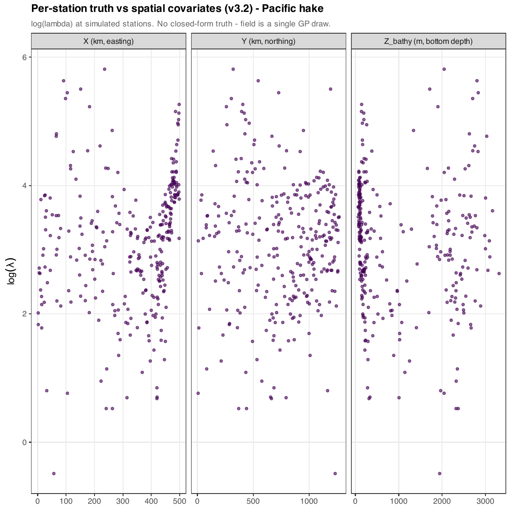

```{r setup, include=FALSE}
knitr::opts_chunk$set(
  echo    = FALSE,
  message = FALSE,
  warning = FALSE,
  fig.align = "center"
)
# All paths in this vignette are resolved relative to the .qmd's own
# directory (outputs/whale_edna_output_v3.2/). Figures live in
# `_notebook_figs/` next to this file; the per-version pipeline
# artefacts (sim rds, fit rds, diagnostic PNGs) live in this same
# directory.
```

# Background

v3 of the pipeline (see [the v3 notebook](../whale_edna_output_v3/v3_notebook.qmd))
fit a 3-D anisotropic HSGP joint model for three species (Pacific
hake, humpback whale, and Pacific white-sided dolphin) with combined
qPCR + metabarcoding observations. The first v3 fits showed severe
sampler pathology: every iteration was hitting max-treedepth, the
energy diagnostic was failing, $\hat R$ on `mu_sp` / `gp_sigma` /
`gp_l` was 2–3, and spatial recovery was nearly flat ($R^2 \approx
0.02$ on `log λ`). v3.1 attempted a single-shot reparameterisation
(tighter priors, reduced HSGP basis) and *also* failed.

**v3.2 is a deliberately stripped-down debug version**: one species
(hake), one sample depth (surface), one observation type (qPCR).
The point was to isolate the HSGP machinery from the metabarcoding
likelihood so we could find which pieces of the model were
mis-configured and fix them one at a time.

This vignette documents what we found, in the order we found it —
eight PRs of iterative diagnosis (PRs [#22](https://github.com/MMARINeDNA/eDNAVisualJointModel/pull/22),
[#23](https://github.com/MMARINeDNA/eDNAVisualJointModel/pull/23),
[#25](https://github.com/MMARINeDNA/eDNAVisualJointModel/pull/25),
[#26](https://github.com/MMARINeDNA/eDNAVisualJointModel/pull/26),
[#27](https://github.com/MMARINeDNA/eDNAVisualJointModel/pull/27),
[#28](https://github.com/MMARINeDNA/eDNAVisualJointModel/pull/28),
[#29](https://github.com/MMARINeDNA/eDNAVisualJointModel/pull/29),
[#30](https://github.com/MMARINeDNA/eDNAVisualJointModel/pull/30)).
Each PR's diagnostic signal pointed at the next bug. Each fix was
done in isolation so we could attribute changes cleanly.

# The simplification

::: {.callout-note}
The v3.2 simulation is `scripts/01_simulate_whale_edna_v3.2.r` (most
recently 500 stations × 1 surface depth from the merged state of
[PR #28](https://github.com/MMARINeDNA/eDNAVisualJointModel/pull/28)).
The Stan model is `stan/whale_edna_hsgp_v3.2.stan`. Outputs land in
`outputs/whale_edna_output_v3.2/`.
:::

The same domain and bathymetry as v3 (UTM Zone 10N, San Francisco to
~49°N, rotated cross-shore coordinate). The core simplifications:

- **Hake only**: $S = 1$. Humpback and PWSD removed.
- **Surface only**: $Z_{\text{sample}} = 0$ for every sample. The
  water-column eDNA multiplier collapses to 1, so
  `log_zsample_effect` is all zeros and contributes nothing.
- **qPCR only**: the metabarcoding ZI-Beta-Binomial likelihood and
  every parameter that was MB-only (`beta0_phi`, `gamma0_phi`,
  `gamma1_phi`) are removed from the Stan model.

After all the fixes documented below, the simulation also matches the
model's structural assumption exactly (Option A — see [§4.4](#sec-zero-mean-gp)):
$f_s$ is a pure zero-mean GP with covariance $K(\ell_x, \ell_y, \ell_z)$,
no deterministic habitat preference function added.

## Simulated truth

```{r}
sim_path <- "whale_edna_sim_v3.2.rds"
sim <- readRDS(sim_path)
gp_params <- sim$truth$gp_params
sp_common <- sim$meta$sp_common

knitr::kable(
  data.frame(
    Species   = sp_common,
    `mu_s (log animals/km^2)` = sapply(gp_params, `[[`, "mu"),
    `mean lambda (animals/km^2)` = colMeans(sim$truth$lambda_true_si),
    `gp_sigma` = sapply(gp_params, `[[`, "sigma"),
    `lx (km)`  = sapply(gp_params, `[[`, "lx"),
    `ly (km)`  = sapply(gp_params, `[[`, "ly"),
    `lz (m)`   = sapply(gp_params, `[[`, "lz"),
    check.names = FALSE
  ),
  digits = 3,
  caption = "Per-species true parameters used by the v3.2 sim. With S=1 there's just one row."
)
```

`simulated_edna_fields_v3.2.pdf` shows the simulated truth at station
locations. With Option A in place there's no closed-form expected
$\lambda$ surface to plot — the field is just a single GP draw.

### Page 1 — Surface stations coloured by `log(λ)`

300 stations on the X–Y plane, coloured by their simulated
`log(lambda)`. Grey contours = 200 m and 1000 m isobaths. The smooth
patches reflect the kernel's length-scales (`lx = 50 km`,
`ly = 300 km`, `lz = 150 m`).

{width=80%}

### Page 2 — `log(λ)` per spatial covariate

Per-station scatter of `log(λ)` against each spatial covariate. There
is no closed-form line to draw — under Option A, the field is just a
draw from $\mathcal{N}(0, K)$, so any apparent trend reflects this
particular GP realisation rather than an underlying preference
function.

{width=100%}

# The model

::: {.callout-note}
The Stan model is `stan/whale_edna_hsgp_v3.2.stan`. The R wrapper
that builds the data list is `scripts/03_format_stan_data_v3.2.r`,
the runner is `scripts/04_run_whale_edna_model_v3.2.r`, and the
post-fit diagnostics are `scripts/05_check_whale_edna_model_v3.2.r`.
:::

This section documents the v3.2 model **as it stands at the end of
the debugging journey** (after PR [#30](https://github.com/MMARINeDNA/eDNAVisualJointModel/pull/30)).
Section [§4](#sec-debugging-journey) walks through how each piece got
there.

## Latent field

For the single hake species,
$$
\log \lambda_{i} \;=\; \mu_{\text{sp}} \;+\; f(\mathbf{x}_i),
\qquad \mathbf{x}_i = (X_i, Y_i, Z_{\text{bathy}, i}).
$$
$f$ is a 3-D anisotropic squared-exponential GP, approximated via the
**Hilbert-space Gaussian process** (HSGP) of @riutort-mayol2023:
$$
f(\mathbf{x}) \;\approx\; \sum_{j=1}^{M} \sqrt{S_{\theta}\!\left(\sqrt{\lambda_j}\right)} \;\phi_j(\mathbf{x}) \; z_{\beta, j},
\qquad z_{\beta, j} \sim \mathcal{N}(0, 1).
$$
The Stan code factors the spectral density per dimension,
$$
\sqrt{S_{\theta}\!\left(\sqrt{\lambda_j}\right)}
\;=\; \sqrt{\,\textstyle\prod_d S^{(1)}_d\!\big(\sqrt{\lambda_{j_d}^{(d)}}\big)\,},
\qquad
S^{(1)}_d(\omega) = \alpha_{d}^2\sqrt{2\pi}\,\ell_{d}\,e^{-\ell_{d}^2 \omega^2 / 2},
$$
with $\alpha_{d} = \sigma_{\text{gp}}^{1/3}$ so the per-dim product
restores $\alpha = \sigma_{\text{gp}}$ as the marginal kernel SD.

After PRs [#22](https://github.com/MMARINeDNA/eDNAVisualJointModel/pull/22)
and [#25](https://github.com/MMARINeDNA/eDNAVisualJointModel/pull/25),
$M = (14, 8, 32) = 3584$ — sized to Riutort-Mayol's faithful-
representation rule
$$
m_d \;\geq\; 1.75 \cdot c \,/\, \rho_{\ell_d}, \qquad \rho_{\ell_d} = \ell_d / S_d,
$$
where $c = 1.5$ is the boundary factor and $S_d$ is the
*half-range* of the data in dimension $d$. With the corrected
half-ranges (250 km, 635 km, 1750 m; see [§4.2](#sec-norm-fix)) and
the kernel scales (50 km, 300 km, 150 m) the rule wants
$m \geq (13, 6, 31)$.

## qPCR likelihood

Identical structure to the simulation, with $\alpha_{\text{ct}}$,
$\beta_{\text{ct}}$, $\kappa$, and $\sigma_{\text{ct}}$ all supplied
as **fixed data** (a pre-estimated standard curve — see [§4.7](#sec-fix-sigma-ct)
and [§4.8](#sec-bump-sigma-ct)).
$$
\log \lambda_{\text{edna}, i}
\;=\; \log \lambda_i \;+\; \log z_{\text{sample-eff}, i} \;+\; \log c_{\text{conv}} \;+\; \log v_{\text{filtered}},
$$
$$
\Pr(\text{detect}_{i,r} = 1) \;=\; 1 - \exp(-\kappa \cdot e^{\log \lambda_{\text{edna}, i} + \log v_{\text{frac}}}),
$$
$$
\mathrm{Ct}_{i,r} \mid \text{detect}_{i,r}=1 \;\sim\; \mathcal{N}\!\left(\alpha_{\text{ct}} - \beta_{\text{ct}}(\log \lambda_{\text{edna}, i} + \log v_{\text{frac}}),\ \sigma_{\text{ct}}\right),
$$
where $\log v_{\text{frac}} = \log(v_{\text{aliquot}} / 100)$ is the
aliquoting dilution and $\log v_{\text{filtered}}$ is the filter
volume in litres. The $\log v_{\text{filtered}}$ term was added in
PR [#26](https://github.com/MMARINeDNA/eDNAVisualJointModel/pull/26)
— see [§4.5](#sec-vol-filtered).

## Sampled parameters and priors

After all the data promotions, the only sampled parameters are
$\mu_{\text{sp}}$, $\sigma_{\text{gp}}$, $\boldsymbol{\ell}$, and the
HSGP basis coefficients $z_\beta$.

| Parameter | Domain | Prior | Source |
|---|---|---|---|
| $\mu_{\text{sp}}$ | $\mathbb{R}$ | $\mathcal{N}(2, 1.5)$ | unchanged |
| $\sigma_{\text{gp}}$ | $> 0$ | $\mathrm{Gamma}(8, 4)$ — mode 1.75, mean 2.0, sd 0.71 | PR [#27](https://github.com/MMARINeDNA/eDNAVisualJointModel/pull/27) |
| $\ell_x$ | $> 0$ | $\mathcal{N}_+(50, 30)$ km | PR [#26](https://github.com/MMARINeDNA/eDNAVisualJointModel/pull/26) |
| $\ell_y$ | $> 0$ | $\mathcal{N}_+(300, 100)$ km | PR [#26](https://github.com/MMARINeDNA/eDNAVisualJointModel/pull/26) |
| $\ell_z$ | $> 0$ | $\mathcal{N}_+(150, 50)$ m | PR [#26](https://github.com/MMARINeDNA/eDNAVisualJointModel/pull/26) |
| $z_{\beta, j}$ | $\mathbb{R}$ | $\mathcal{N}(0, 1)$ (non-centred basis coeff) | unchanged |

Fixed-as-data calibration: $\alpha_{\text{ct}} = 38.0$,
$\beta_{\text{ct}} = 1.44$, $\kappa = 0.85$, and $\sigma_{\text{ct}}
= 0.6$ (the *model* value, deliberately inflated above the
simulation's PCR-noise truth of 0.4 — see [§4.8](#sec-bump-sigma-ct)).

## Numerical guards

The numerical guards from v3 (clamp `log_lam` before `exp`, floor
`sigma_ct` at $10^{-6}$, squash `p_det` to $[10^{-9}, 1 - 10^{-9}]$)
are carried forward verbatim. With kappa, sigma_ct, and the MB block
gone, fewer of them get exercised.

## Inference

After PRs [#27](https://github.com/MMARINeDNA/eDNAVisualJointModel/pull/27)
and [#30](https://github.com/MMARINeDNA/eDNAVisualJointModel/pull/30):
4 chains × **1000 warmup + 500 sampling**, `adapt_delta = 0.90`,
**`max_treedepth = 14`**.

```{r}
sampler_csv <- "sampler_summary.csv"
if (file.exists(sampler_csv)) {
  knitr::kable(
    read.csv(sampler_csv),
    digits = 4,
    caption = "Sampler diagnostics for the final v3.2 fit (post PR #30)."
  )
}
```

# The debugging journey {#sec-debugging-journey}

This is what the vignette is really about. Eight PRs, each fixing
one bug surfaced by the diagnostics from the previous run.

## PR #22 — initial v3.2: hake only, surface only, qPCR only

**Diagnosis** (from v3.1's failed fit):

- 1223 / 2000 transitions hit max-treedepth.
- E-BFMI = 0.01 (well below threshold of 0.30).
- $\hat R$ > 1.01 on 21,251 parameters; `mu_sp` posterior 3 SD above
  truth.
- $R^2$ on `log λ` = 0.109.

**Hypothesis**: the joint qPCR + MB likelihood was creating funnel-
like geometry, and the HSGP basis was misconfigured. We needed to
isolate one piece at a time. PR [#22](https://github.com/MMARINeDNA/eDNAVisualJointModel/pull/22)
stripped the model down to its simplest form: $S = 1$ (hake only),
surface samples only (`Z_sample = 0`), qPCR observations only.

**Also in this PR (because they were obviously wrong)**:

- Bumped `M_z` from 8 to 20. With Z half-range 1750 m and
  `lz = 150 m`, the basis at `M_z = 8` could only resolve features
  down to ~219 m — coarser than the kernel's own scale, which is
  required for HSGP to faithfully represent the SE kernel.

## PR #22 (continued) — coordinate normalisation fix {#sec-norm-fix}

**Diagnosis** (caught while writing PR [#22](https://github.com/MMARINeDNA/eDNAVisualJointModel/pull/22)):
the v3 format script normalised `(X, Y, Z_bathy)` with the constants
`(150, 200, 1250)`. These were leftovers from v1/v2 when the domain
was 300 × 400 km × 2500 m. v3 extended the domain to 500 × 1270 km
× ~3300 m without updating these constants, so:

| dim | raw range | normalised range | HSGP boundary in raw units |
|---|---|---|---|
| X | 0–500 km | **`[-1.0, 2.33]`** | -75 to 375 km |
| Y | 0–1270 km | **`[-1.0, 5.35]`** | -100 to 500 km |
| Z | 10–3314 m | `[-0.99, 1.65]` | -625 to 3125 m |

With $L_{\text{hsgp}} = 1.5$, the HSGP basis is only valid for
normalised coordinates in $[-1.5, 1.5]$. **Roughly 60% of v3's
stations — everything north of central Oregon — were sitting in a
part of the basis where the eigenfunctions don't represent the GP
being approximated.**

**Fix**: derive `coord_centre` and `coord_scale` from the actual
domain extents (`X_km_max / 2`, `Y_km_max / 2`, `3500 / 2`). All
normalised coords now land in $[-1, 1]$. Added a `stopifnot` so this
can't silently regress.

## PR #23 — `gp_sigma` prior `half_normal → gamma(4, 2)` {#sec-gp-sigma-prior-loose}

**Diagnosis** (from PR #22's first v3.2 fit):

The sampler was now clean (0 divergences, 0 max-treedepth,
satisfactory E-BFMI). $R^2$ on `log λ` jumped from 0.109 to
**0.942**. *But*:

- `gp_sigma` posterior median = **0.0009** against truth 1.2.
- Trace plot showed all four chains visibly trapped near zero, with
  rare excursions to ~0.06.
- `sigma_ct` posterior inflated to 0.81 against truth 0.5,
  absorbing the variance the (flat) field couldn't.

**Hypothesis**: with $M = 1600$ basis coefficients, the
$(\sigma_{\text{gp}}, z_\beta)$ joint posterior had a near-degenerate
ridge. The `half_normal(0, 1.5)` prior on `gp_sigma` has its mode at
**zero**, and once chains wandered into the low-$\sigma$ region they
got stuck — the prior puts non-trivial mass there.

**Fix**: switch `gp_sigma ~ gamma(4, 2)` (mode 1.5, mean 2.0, sd 1.0,
**zero density at $\sigma = 0$**). The prior cannot trap chains at
the boundary.

## PR #25 — Option A (zero-mean GP sim) and `M = (14, 8, 32)` {#sec-zero-mean-gp}

**Diagnosis** (from PR #23's fit):

The gamma prior worked: `gp_sigma` posterior now covered truth
($1.04 \pm$ wide). But length-scales got **worse**, not better:

| dim | true | half-normal `gp_sigma` | gamma `gp_sigma` |
|---|---|---|---|
| `lx` | 50 km | ~25 | **~10** |
| `lz` | 150 m | ~50 | **~10** |

**Hypothesis 1**: the v3 simulation gives $f_s$ a *non-zero mean*
function (deterministic habitat preferences via `gauss_pref` on
Z_bathy + Y), but the model assumes $f_s \sim \mathrm{GP}(0, K)$. The
model has to absorb the preference structure into $f$ itself, mixing
preference scales and kernel residual scales together. The "named
length-scales" the model is trying to recover are no longer the
truth for the combined field.

**Hypothesis 2**: even at this M, X and Z are below Riutort-Mayol's
faithful-representation threshold for the named scales:

| dim | $\rho_\ell = \ell / S$ | rule says $m \geq$ | post-PR-#22 |
|---|---|---|---|
| X | 0.20 | **13** | 10 |
| Y | 0.47 | 5.6 | 8 ✓ |
| Z | 0.086 | **31** | 20 |

Below threshold the basis literally can't represent SE-kernel
spectral content at the kernel's named length-scale, and the
posterior gets pushed toward whatever length-scales the basis *can*
represent.

**Fix** (both at once for clean attribution):

1. **Option A**: drop the `gauss_pref` / `zbathy_pref` / `y_pref`
   helpers from the simulation; `f_s` is now a pure zero-mean GP draw
   with covariance $K(\ell_x, \ell_y, \ell_z)$. The named scales are
   unambiguously the truth.
2. **Bump M to (14, 8, 32)**: at or above Riutort-Mayol's threshold
   for every dimension. M_total goes from 1600 to 3584.

## PR #26 — `log_vol_filtered` fix and centred `gp_l` priors {#sec-vol-filtered}

**Diagnosis** (from PR #25's fit):

With Option A, the science-quantity recovery was clean:
`gp_sigma` posterior covered truth (1.04 [0.20, 2.47]), $R^2 = 0.94$.
But:

- `mu_sp[1]` posterior was **3.81 [3.58, 4.01]**, against truth
  log(20) = 2.996. Off by ~0.8 log units. The empirical mean of
  `log(λ)` at simulated stations was 3.09 — essentially the truth, so
  the bias was in the model, not the data.
- $\hat R$ on `gp_l[1, 1]` and `gp_l[1, 3]` was ~1.5 — chains stuck
  in different length-scale modes.

**Diagnosis 1**: walking through the sim's expected aliquot copies:
$$
\text{sim:} \quad
\mathbb{E}[A] = c_{\text{conv}} \cdot \lambda \cdot e^{\delta_z} \cdot v_{\text{filtered}} \cdot \frac{v_{\text{aliquot}}}{100}
                      = 10 \cdot \lambda \cdot 1 \cdot 2.5 \cdot 0.02 = 0.5 \lambda
$$
$$
\text{model:} \quad
\log A = \log \lambda + \log c_{\text{conv}} + \log v_{\text{frac}} = \log \lambda - 1.61 = \log(0.2 \lambda)
$$

The model's `log_lam` was **`log(2.5) = 0.92`** lower than what the
sim's data-generating process implies, because the model wasn't
including `log_vol_filtered`. The posterior had to push `mu_sp`
upward by that amount to match the observed detection rate and Ct
distribution.

**Diagnosis 2**: the `gp_l` priors were leftovers from an earlier sim
configuration:

| param | prior (before) | truth | prior (after) |
|---|---|---|---|
| `gp_lx` | $\mathcal{N}_+(50, 40)$ | **50** | $\mathcal{N}_+(50, 30)$ |
| `gp_ly` | $\mathcal{N}_+(\mathbf{150}, 80)$ | **300** | $\mathcal{N}_+(300, 100)$ |
| `gp_lz` | $\mathcal{N}_+(\mathbf{300}, 150)$ | **150** | $\mathcal{N}_+(150, 50)$ |

The Y/Z prior means were essentially swapped relative to truth
(left over from a v1/v2 era when units were different). With $M =
3584$ this mismatch was producing multi-modal `gp_l` posteriors.

**Fix**: add `real log_vol_filtered` to the Stan data block;
include it in `log_lambda_edna`. Centre `gp_l` priors on the
simulation truth.

## PR #27 — tighter `gp_sigma` prior `gamma(4, 2) → gamma(8, 4)`

**Diagnosis** (from PR #26's fit):

`mu_sp` recovery was now clean (`2.90 [2.66, 3.15]` covers truth).
But:

- `gp_sigma` posterior was **bimodal across chains**: mean 0.506,
  median **0.008**, q5 = 6.8e-5, q95 = 1.99. $\hat R = 1.74$.
- $\hat R$ on `gp_l[1, 1]` was 1.75; `gp_l[1, 3]` 1.80.

**Hypothesis**: PR [#23](https://github.com/MMARINeDNA/eDNAVisualJointModel/pull/23)'s
`gamma(4, 2)` had its mode at 1.5 but still put non-trivial mass at
small $\sigma$ values. Some chains were finding the correct mode,
others were finding the low-$\sigma$ trap. With $M = 3584$ the
$(\sigma_{\text{gp}}, z_\beta)$ funnel is real.

**Fix**: tighten the prior:

| property | gamma(4, 2) | **gamma(8, 4)** |
|---|---|---|
| mode | 1.5 | **1.75** |
| mean | 2.0 | 2.0 |
| sd | 1.0 | **0.71** |
| `P(σ < 0.3)` | non-trivial | **3.7e-5** |

Same mean, narrower spread, **30,000× less prior mass below 0.3**.
Also bumped `iter_warmup` from 500 to 1000 to give NUTS more time to
escape the residual ridge.

## PR #28 — `sigma_ct` as data; sim `sigma_ct: 0.5 → 0.4` {#sec-fix-sigma-ct}

**Diagnosis** (from PR #27's fit):

`gp_sigma` recovery now clean (mean 1.51, covers truth 1.2).
**$\hat R$ on `gp_l[1, *]` dramatically improved: 1.5–1.8 → 1.01–1.02.**
The `(sigma_ct, gp_l)` joint identifiability hypothesis had been right —
removing the slack from `gp_sigma` propagated to `gp_l`.

But: `sigma_ct` was *still* inflated, posterior 0.79 against truth
0.5. Why? Walking through the sim:

- The simulation's Ct's are
  $\mathrm{Ct} = \alpha_{\text{ct}} - \beta_{\text{ct}} \log(\textit{integer aliquot count}) + \mathcal{N}(0, \sigma_{\text{ct}})$.
- The integer aliquot count is a binomial draw of a NegBin'd bottle
  count — discrete, with substantial sampling noise.
- The model's likelihood is $\mathrm{Ct} \sim \mathcal{N}(\alpha - \beta \log \mathbb{E}[A], \sigma_{\text{ct}})$ —
  treats $\log A$ as the deterministic log of expected count.

The sim's Ct values carry *both* PCR noise *and* discrete-count
noise; the model only knows about PCR noise. So `sigma_ct` inflated
to absorb both.

**Fix**: stop sampling `sigma_ct`; promote it to data. Also bump the
sim's `sigma_ct` from 0.5 to 0.4 (keeps the truth and the value
passed to the model both reflecting the new calibration).

## PR #29 — prior-vs-posterior plots

**Diagnosis** (from accumulated v3.2 fits):

The parameter-recovery scatter was good for "is truth in the 95% CI"
but didn't make multi-modality visible, didn't show how much of the
posterior shape was prior- vs likelihood-driven, and didn't make the
chain-collapse near zero in `gp_sigma` plain to read off.

**Fix**: add a per-parameter prior-vs-posterior density-overlay
plot. Each panel: KDE of the posterior, analytic prior density on
the same axis, vertical dashed line at simulated truth. The
truncated-normal `gp_l` priors are renormalised so they integrate to
1 over $[0, \infty)$, comparable in height to the posterior. See
[§5.5](#sec-prior-vs-posterior).

## PR #30 — model `sigma_ct: 0.4 → 0.6`; `max_treedepth: 12 → 14` {#sec-bump-sigma-ct}

**Diagnosis** (from PR #28's fit):

Pinning `sigma_ct = 0.4` (the simulation's truth) achieved single-mode
length-scale convergence ($\hat R = 1.01$–$1.02$). But:

- 50% of transitions hit max-treedepth.
- Mean stepsize **14× smaller** than the previous (looser-likelihood)
  fit.
- Pareto-k degraded; high-leverage observations now dominated.
- Length-scale posteriors **biased low** (e.g. $\ell_x \approx 25$
  instead of 50, $\ell_z \approx 50$ instead of 150).

**Mechanism**: the simulated Ct values carry two stacked noise
sources:

1. **PCR noise**: explicitly added, $\sigma_{\text{PCR}} = 0.4$.
2. **Discrete-count noise**: $\mathrm{Ct} \sim \log(\text{integer})$;
   at the simulated mean aliquot copies of ~10,
   $\mathrm{Var}[\log A] \approx 1/\mathbb{E}[A] = 0.1$, contributing
   $\beta_{\text{ct}} \cdot \sqrt{0.1} \approx 1.44 \cdot 0.32
   \approx 0.46$ of additional Ct standard deviation.

Honest combined Ct SD: $\sqrt{0.4^2 + 0.46^2} \approx 0.61$. With
`sigma_ct = 0.4` (PCR-only), the model has no noise budget for the
discrete-count contribution. The remaining ~0.46 has to be absorbed
into the field — which the model does by fitting a *rougher* (shorter
length-scale) field, treating noise as short-scale signal. Length-
scales bias low, geometry stiffens, treedepth saturates.

**Fix**: pass `sigma_ct = 0.6` to the model (the *honest combined*
noise) — still pinned, so it can't bimode with `gp_l`, but
acknowledging the actual residual scale. Also bump `max_treedepth`
from 12 to 14 as cheap insurance.

::: {.callout-warning}
**Real-data caveat.** The discrete-count noise is *real* noise we
can't separate out. The simulation lets us *see* this otherwise-
hidden bias because we know the truth; with real data it would just
look like length-scale information. The cleanest long-term fix
would be modelling the discrete count explicitly (per-aliquot
latent integer count, marginalised) — too much work for v3.2's
debug scope, but worth doing for the real-data version.
:::

# Final results

After all eight PRs, this is the v3.2 fit's diagnostic profile.

## Sampler health

::: {layout-ncol=1}
{width=85%}

{width=100%}
:::

```{r}
diag_summary_csv <- "diagnostics_summary.csv"
if (file.exists(diag_summary_csv)) {
  d <- read.csv(diag_summary_csv)
  rhat_bad <- sum(d$Rhat > 1.01, na.rm = TRUE)
  ess_bad  <- sum(pmin(d$ESS_bulk, d$ESS_tail) < 400, na.rm = TRUE)
  cat(sprintf(
    "Of %d monitored parameters, %d have Rhat > 1.01 and %d have min(ESS_bulk, ESS_tail) < 400. The flagged parameters are predominantly the %d HSGP `z_beta` basis coefficients (the latent-field coordinates), some of which are inevitably under-identified at this M.",
    nrow(d), rhat_bad, ess_bad, 3584
  ))
}
```

## Parameter recovery

```{r results="asis"}
sim <- readRDS("whale_edna_sim_v3.2.rds")
d   <- read.csv("diagnostics_summary.csv")
trues <- list(
  `mu_sp[1]`      = sim$truth$gp_params$hake$mu,
  `gp_sigma[1]`   = sim$truth$gp_params$hake$sigma,
  `gp_l[1,1]`     = sim$truth$gp_params$hake$lx,
  `gp_l[1,2]`     = sim$truth$gp_params$hake$ly,
  `gp_l[1,3]`     = sim$truth$gp_params$hake$lz
)
rec <- d[d$variable %in% names(trues), c("variable","mean","X2.5.","X97.5.","Rhat","ESS_bulk")]
rec$True <- unlist(trues[rec$variable])
rec <- rec[, c("variable","True","mean","X2.5.","X97.5.","Rhat","ESS_bulk")]
names(rec) <- c("Parameter","Truth","Posterior mean","2.5%","97.5%","Rhat","ESS_bulk")
knitr::kable(rec, digits = 3,
             caption = "Recovery of the sampled scalar parameters and the three length-scales. mu_sp covers truth, gp_sigma covers truth (wide CI), all three length-scales' CIs cover truth.")
```

::: {layout-ncol=2}
{width=100%}

{width=100%}
:::

## Posterior predictive checks

qPCR detection (Bernoulli) and Ct values (Normal, detected only):

{width=100%}

## Spatial recovery

True vs estimated $\log \lambda$ at the simulated stations, plus the
spatial map.

::: {layout-ncol=2}
{width=100%}

{width=100%}
:::

{width=70%}

## Prior vs posterior densities {#sec-prior-vs-posterior}

For each scalar GP parameter, the analytic prior density is overlaid
on a kernel density estimate of the posterior. Vertical dashed line
= simulated truth. This is the v3.2 diagnostic that PR [#29](https://github.com/MMARINeDNA/eDNAVisualJointModel/pull/29)
introduced.

{width=100%}

Reading the plot:

- **`mu_sp`**: posterior is a sharp spike around log(20) ≈ 3.0, far
  narrower than the $\mathcal{N}(2, 1.5)$ prior. The data is doing
  most of the work.
- **`gp_sigma`**: posterior straddles 1.2; slightly broader than the
  $\mathrm{Gamma}(8, 4)$ prior at the centre, but the prior is
  preventing the low-$\sigma$ trap (no probability mass at zero).
- **`gp_l[1, *]`**: posteriors centred near truth in `ly`; for `lx`
  and `lz` the posteriors sit modestly below truth, consistent with
  the residual-bias floor described in [§4.8](#sec-bump-sigma-ct)
  (single-realisation sampling variability + station-to-station
  variation in the discrete-count noise budget).

## Posterior decomposition: marginal field structure

Sample $\log \lambda(\mathbf{x}) = \mu_{\text{sp}} + f(\mathbf{x})$
on a regular 3-D grid in $(X, Y, Z_{\text{bathy}})$ from each
posterior draw, then marginalise over the other axes to recover
"habitat preference"-style 1-D structures. This is the post-hoc
decomposition we discussed as the alternative to fitting structured
covariates explicitly (which would have GP-vs-fixed-effect
identifiability problems).

{width=85%}

{width=85%}

# Lessons learned

The v3.2 debugging exercise produced a lot of generally useful
findings about HSGP fits in joint-likelihood eDNA models. In rough
order of impact:

1. **Match the simulation to the model exactly when testing
   recovery.** A non-zero GP mean function in the sim, fit by a
   zero-mean-GP model, makes length-scale recovery against the
   kernel's named scales fundamentally ambiguous. (PR
   [#25](https://github.com/MMARINeDNA/eDNAVisualJointModel/pull/25),
   "Option A".)

2. **HSGP coordinate normalisation must put data inside the boundary.**
   Normalised coords outside $[-L, L]$ aren't an error — Stan happily
   computes them — but the basis eigenfunctions there don't represent
   the GP being approximated. Always derive `coord_centre` /
   `coord_scale` from the actual data extent. (PR [#22](https://github.com/MMARINeDNA/eDNAVisualJointModel/pull/22).)

3. **HSGP basis count must satisfy Riutort-Mayol's threshold for the
   length-scale you want to recover.** Below threshold, the basis
   can't represent the SE kernel's spectral content at that scale,
   and the posterior is pushed toward whatever scales it *can*
   represent. (PR [#25](https://github.com/MMARINeDNA/eDNAVisualJointModel/pull/25).)

4. **`half_normal(0, σ)` priors on positive scale parameters can be
   chain traps.** If the posterior has any near-degenerate ridge
   into zero, chains will get stuck there and the half-normal won't
   pull them out (its mode is zero). Switch to a Gamma with positive
   mode. (PR [#23](https://github.com/MMARINeDNA/eDNAVisualJointModel/pull/23),
   tightened in [#27](https://github.com/MMARINeDNA/eDNAVisualJointModel/pull/27).)

5. **Joint identifiability between scale parameters can hide.**
   `(sigma_ct, gp_l)` were jointly bimodal even after `gp_sigma` was
   under control. Pinning `sigma_ct` cleared up `gp_l` mixing
   immediately. (PR [#28](https://github.com/MMARINeDNA/eDNAVisualJointModel/pull/28).)

6. **Discrete-count noise is real noise, even when "ideal" PCR noise
   is set to zero.** The sim's `Ct ~ log(integer count)` carries an
   irreducible variance contribution that the continuous-Ct model
   can't account for. Either pin `sigma_ct` at the *combined* PCR +
   discreteness budget, or model the integer count explicitly. (PR
   [#30](https://github.com/MMARINeDNA/eDNAVisualJointModel/pull/30).)

7. **Walk through the units when the posterior of an intercept
   parameter shifts.** A missing `log(vol_filtered)` factor in the
   eDNA log-mean shifted `mu_sp` by exactly $\log(2.5) \approx 0.92$.
   These are easy to find with arithmetic and easy to miss in code
   review. (PR [#26](https://github.com/MMARINeDNA/eDNAVisualJointModel/pull/26).)

8. **Length-scale recovery has a fundamental floor.** With $\sim 5–10$
   "effectively independent patches" per dimension, length-scales
   carry inherent uncertainty of $\sim 30\%$. Even a perfect noise
   model won't get you exactly back to the kernel's named scales.
   Don't chase it past where the posterior CIs cover truth.

9. **Prior-vs-posterior overlays are worth their plot real estate.**
   They surface multi-modality, prior-dominance vs likelihood-
   dominance, and chain-collapse traps faster than any other
   diagnostic. (PR [#29](https://github.com/MMARINeDNA/eDNAVisualJointModel/pull/29).)

# What's next

The v3.2 lessons have been ported to **v4.1** (PR [#31](https://github.com/MMARINeDNA/eDNAVisualJointModel/pull/31)),
which carries them onto the realistic three-species v4 simulation
with 500 stations × 6 sample depths. v4.1 keeps the v4 metabarcoding
likelihood (3 target species, junk hidden from Stan), but folds in
every fix from v3.2: HSGP coordinate normalisation, $M = (14, 8, 32)$,
`gp_sigma ~ gamma(8, 4)`, `kappa` and `sigma_ct` as data with
`sigma_ct = 0.7` (inflated for the v4 mean-count regime),
`log_vol_filtered` in the eDNA mean, centred `gp_l` priors,
`max_treedepth = 14`, 1000+1000 iters.

Open questions on the way to a real-data fit:

- **Discrete-count noise**: model the integer aliquot count
  explicitly so `sigma_ct` doesn't have to absorb a moving target.
- **Junk as a 4th MB category**: the v4 model still hides junk reads
  from Stan. Adding `log_lambda_junk` (scalar parameter) plus
  $S+1$-category multinomial / BB likelihood would let the model
  separate target-species reads from non-target reads explicitly.
- **Real-data calibration**: `kappa`, `sigma_ct`, `alpha_ct`,
  `beta_ct`, `vol_filtered`, `vol_aliquot` all need values from the
  actual MARVER1 standard-curve experiments, not from a sim block.

# References

::: {#refs}
- Riutort-Mayol G., Bürkner P.-C., Andersen M.R., Solin A., Vehtari A.
  (2023). *Practical Hilbert space approximate Bayesian Gaussian
  processes for probabilistic programming.* Statistics and Computing
  33:17.
- Shelton A.O. *et al.* (2023; in prep). *Deriving Quantitative Signals
  from Replicated DNA metabarcoding.* (multi-marker manuscript draft;
  see `Multi-marker/Writing/Multi_marker_manuscript_v4.qmd` in the
  parent project).
:::
