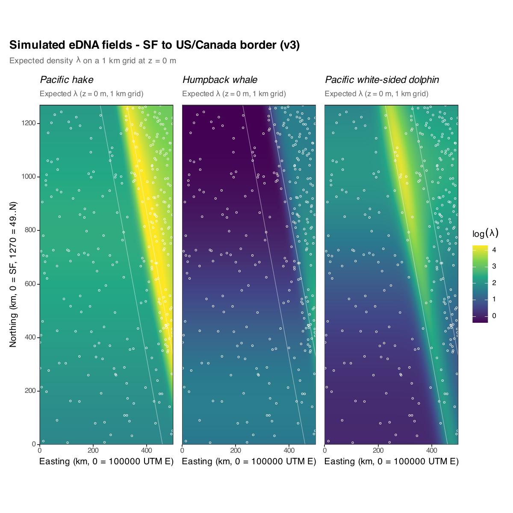
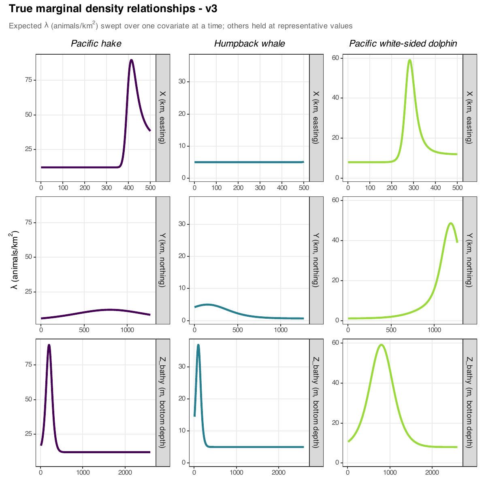
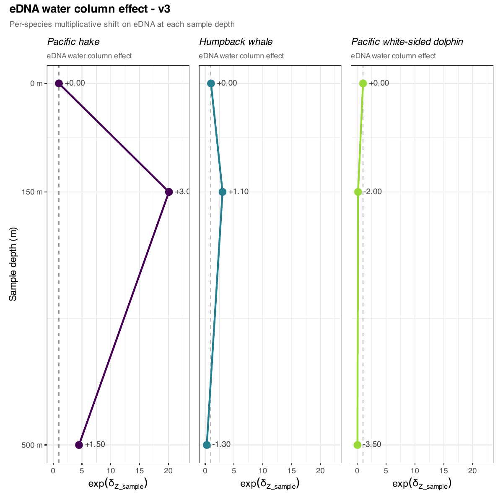

```{r setup, include=FALSE}
knitr::opts_chunk$set(
  echo    = FALSE,
  message = FALSE,
  warning = FALSE,
  fig.align = "center"
)
# All paths in this vignette are resolved relative to the .qmd's own
# directory (outputs/whale_edna_output_v3/). Figures live in
# `_vignette_figs/` next to this file; the per-version pipeline
# artefacts (sim rds, fit rds, diagnostic PNGs) live in this same
# directory.
```

# Background

Environmental DNA (eDNA) sampling — filtering water, extracting DNA, and
assaying it with **qPCR** and/or **metabarcoding** — has matured into a
core ecological survey tool over the last decade. Two threads in
particular are converging:

1. **Multiple data types per sample**. A single bottle of water is
   often assayed both with a species-specific qPCR for one or two
   target taxa and with a multi-species metabarcoding marker (e.g.
   MARVER1) that picks up many species at once. Joining these two data
   streams into a single coherent inference is statistically delicate
   — qPCR is approximately quantitative for the target species, while
   metabarcoding read counts are *compositional* and obscured by PCR
   bias and sequencing depth [@shelton2023; @gloor2017].

2. **Spatial structure**. Where you place the sampling stations is
   itself a signal — and a confounder. Realistic eDNA studies have
   stations stratified by bathymetry / coastline, and target species
   that are themselves structured along latitude, depth, and habitat
   gradients. A joint model has to handle the spatial smoothness of
   the latent biomass field as well as the per-bottle observation
   noise.

This vignette walks through **v3** of the pipeline that combines:

- a realistic three-species simulator covering the US West Coast from
  San Francisco to the US/Canada border, with rotated bathymetry,
  realistic species spatial preferences, and matched qPCR + MARVER1
  metabarcoding observation models, and
- a 3-D anisotropic **Hilbert-Space approximate Gaussian process**
  (HSGP, @riutort-mayol2023) joint model for `log(λ_si)` (log eDNA
  concentration for species $s$ at sample $i$), fit in Stan via
  CmdStanR.

# The simulation

::: {.callout-note}
The simulation is implemented in
`scripts/01_simulate_whale_edna_v3.r`. Output saved to
`outputs/whale_edna_output_v3/whale_edna_sim_v3.rds`.
:::

## Domain and bathymetry

The study area is **UTM Zone 10N** spanning
`[100 000, 600 000] m` Easting (500 km E–W) and
`[4 180 000, 5 450 000] m` Northing (~1270 km N–S, San Francisco at
~37.77°N to the US/Canada border at ~49°N).

Rather than a simple east-west bathymetric profile, v3 uses a **rotated
cross-shore coordinate** `X_prime` so the shelf-slope isobaths run
NW–SE (roughly parallel to the real US West Coast):

$$
X_{\text{prime}}(X, Y) \;=\; 300 \cdot \frac{\cos(\theta)\,\tilde{X} \;+\; \sin(\theta)\,\tilde{Y}}{\cos(\theta) + \sin(\theta)},
$$

where $\tilde{X} = X / X_{\max}$, $\tilde{Y} = Y / Y_{\max}$, and
$\theta = 25°$. Bathymetry is then a logistic shelf-slope profile in
`X_prime`:

$$
Z_{\text{bathy}}(X, Y) \;=\; \max\!\left(\, Z_{\text{abyssal}} + \frac{Z_{\text{shelf}} - Z_{\text{abyssal}}}{1 + e^{-k\,(X_{\text{prime}} - X_{\text{break}})}},\; 10 \right),
$$

with `Z_abyssal = 2500 m`, `Z_shelf = 80 m`,
`X_break = 180 km`, and `k = 0.06`. The 25° tilt is small enough that
both shelf and offshore samples are available at every latitude — a
pure 45° rotation in this elongated domain confounds latitude with
bathymetry.

## Species and spatial structure

Three target species:

| Species | Spatial / habitat preference |
|---|---|
| Pacific hake (*Merluccius productus*) | shelf-slope break, broad latitude |
| Humpback whale (*Megaptera novaeangliae*) | southern + inshore shelf |
| Pacific white-sided dolphin (*Lagenorhynchus obliquidens*) | northern + offshore slope |

For each species $s$ the latent log-density at location $(X, Y, Z_{\text{bathy}})$ is

$$
\log \lambda_s(X, Y, Z_{\text{bathy}})
\;=\; \mu_s \;+\; f_s(X, Y, Z_{\text{bathy}}),
$$

where $\mu_s$ is a species-specific intercept and
$f_s \sim \mathcal{GP}(m_s, K_s)$ is a 3-D anisotropic squared-exponential
GP. **All habitat structure** (bathymetric preference + latitude band)
is absorbed into the GP's mean function $m_s$:

$$
m_s(X, Y, Z_{\text{bathy}})
\;=\; g_s^{(\text{bathy})}(Z_{\text{bathy}}) \;+\; g_s^{(\text{lat})}(Y),
$$

with each $g(\cdot)$ a Gaussian-shaped preference scaled to amplitude
$A$ on the log scale: $g(x) = A \cdot \big(\, \tfrac{\phi(x; \mu, \sigma)}{\phi(\mu; \mu, \sigma)} - \tfrac{1}{2}\big)$.
This is mathematically identical to a $\mu_s + \text{mean fn} + \text{zero-mean GP}$
decomposition, but matches what the Stan model fits: a single GP term
with a non-trivial mean.

## Sampling design

- **300 stations**, stratified 50/30/20 shelf / slope / offshore on
  the rotated coordinate (rejection sampling in $(X, Y)$).
- **3 sample depths** per station: 0 m, 150 m, 500 m.
- Samples with $Z_{\text{sample}} > Z_{\text{bathy}}$ are dropped (can't
  sample below the seafloor). Final $N \approx 650$.

## Observation models

Each sample produces a *bottle eDNA copy count* per species via a
negative binomial,

$$
C_{\text{bottle}, i, s} \;\sim\; \mathrm{NB}\!\left(\mu = c \cdot \lambda_{i,s} \cdot v_{\text{filtered}} \cdot e^{\delta_{Z_{\text{sample}}, s}},\; \theta = 10\right),
$$

where $c$ is the animals → eDNA conversion factor and $\delta_{Z, s}$
is the species-specific water-column eDNA effect at that sampling
depth.

Aliquots (subsampled volumes from each bottle) then go to **qPCR**
(hake only) and **metabarcoding** (all three species).

### qPCR (hake only)

For each of $R = 3$ qPCR replicates per sample we draw an aliquot copy
count $A_{\text{qpcr}}$ from a binomial dilution of the bottle, then
detect/quantify with a hurdle:

$$
\mathbb{P}(\text{detect}) \;=\; 1 - \exp(-\kappa \cdot A_{\text{qpcr}}),
$$

and given detection, the cycle threshold is

$$
\mathrm{Ct} \;=\; \alpha_{\text{ct}} - \beta_{\text{ct}} \log \max(A_{\text{qpcr}}, 1) + \varepsilon_{\text{ct}},
\quad \varepsilon_{\text{ct}} \sim \mathcal{N}(0, \sigma_{\text{ct}}).
$$

### Metabarcoding (all 3 species, MARVER1)

For each of $K = 3$ metabarcoding replicates we draw aliquot copies
per species $A_{\text{mb}, s}$, compute compositional proportions
$\pi_{i,s} = A_{\text{mb}, s} / \sum_{s'} A_{\text{mb}, s'}$, and draw
read counts via a multinomial with read depth $\sim \mathrm{Unif}(25{,}000,\,50{,}000)$.
This matches the structure used in the [eDNA multi-marker manuscript][shelton-mm]
[@shelton2023; section *Materials and Methods (Part 2)*].

[shelton-mm]: ../../Multi-marker/Writing/Multi_marker_manuscript_v4.qmd

## Simulated truth — what comes out of step 01

```{r}
sim_path <- "whale_edna_sim_v3.rds"
sim <- readRDS(sim_path)
n_species <- sim$meta$n_species
sp_common <- sim$meta$sp_common
gp_params <- sim$truth$gp_params

knitr::kable(
  data.frame(
    Species   = sp_common,
    `mu_s (log animals/km^2)` = sapply(gp_params, `[[`, "mu"),
    `mean lambda (animals/km^2)` = colMeans(sim$truth$lambda_true_si),
    `gp_sigma` = sapply(gp_params, `[[`, "sigma"),
    `lx (km)`  = sapply(gp_params, `[[`, "lx"),
    `ly (km)`  = sapply(gp_params, `[[`, "ly"),
    `lz (m)`   = sapply(gp_params, `[[`, "lz"),
    check.names = FALSE
  ),
  digits = 3,
  caption = "Per-species true parameters used by the v3 sim."
)
```

Each page below corresponds to one panel of
`outputs/whale_edna_output_v3/simulated_edna_fields_v3.pdf`,
which is the canonical "simulated truth" plot for v3. The plotting
code is `scripts/02_plot_simulated_data_v3.r`.

### Page 1 — Expected density surface

The expected log-density surface for each species, computed in closed
form on a 1 km × 1 km grid (no kriging — every grid cell is
$\mu_s + g_s^{(\text{bathy})}(Z_{\text{bathy}}(X, Y)) + g_s^{(\text{lat})}(Y)$).
Open white circles are station locations.

{width=100%}

### Page 2 — True marginal relationships

Sweep one covariate at a time across the domain with the others held
at representative values. Rows are spatial covariates (X, Y,
$Z_{\text{bathy}}$); columns are species. Each species column has its
own y-scale because densities differ by orders of magnitude.

{width=100%}

### Page 3 — Water column effect

The depth-specific multiplier on eDNA at each sampling depth — these
are the $\delta_{Z, s}$ values that go into the negative binomial
mean. Hake peaks at 150 m; humpback peaks slightly at 150 m and is
suppressed at 500 m; PWSD is surface-active and strongly suppressed at
depth.

{width=100%}

# The model

::: {.callout-note}
The Stan model is `stan/whale_edna_hsgp_v3.stan`. The R wrapper that
builds the data list is `scripts/03_format_stan_data_v3.r`, and the
runner that compiles + samples is `scripts/04_run_whale_edna_model_v3.r`.
:::

## Latent field with HSGP

The model fits exactly the form the simulation exposes:

$$
\log \lambda_{i, s} \;=\; \mu_s \;+\; f_s(\mathbf{x}_i),
\qquad \mathbf{x}_i = (X_i, Y_i, Z_{\text{bathy}, i}).
$$

A *direct* GP fit would be $O(N^3)$ per iteration ($N \approx 650$).
v3 instead uses the **Hilbert-space approximate GP** of
@riutort-mayol2023 [hereafter RMBA+S]: each $f_s$ is approximated by a
truncated basis-function expansion using Laplace eigenfunctions on a
bounded domain $\Omega \subset \mathbb{R}^3$ scaled to $[-1, 1]^3$,

$$
f_s(\mathbf{x}) \;\approx\; \sum_{j=1}^{M} \sqrt{S_{\theta_s}\!\left(\sqrt{\lambda_j}\right)} \;\phi_j(\mathbf{x}) \; z_{\beta, s, j},
\qquad z_{\beta, s, j} \sim \mathcal{N}(0, 1),
$$

where $\phi_j$ are the 3-D Laplace eigenfunctions, $\lambda_j$ their
eigenvalues, and $S_{\theta_s}$ the spectral density of the
anisotropic SE kernel with length-scales
$\boldsymbol{\ell}_s = (\ell_{X,s}, \ell_{Y,s}, \ell_{Z,s})$ and
marginal SD $\alpha_s$:

$$
S_{\theta_s}(\boldsymbol{\omega}) \;=\; \alpha_s^2 (2\pi)^{D/2}\,\prod_d \ell_{d,s} \;\exp\!\left(-\tfrac{1}{2} \sum_d \ell_{d,s}^2 \omega_d^2\right).
$$

Index $j$ runs over a 3-tuple $(j_1, j_2, j_3)$; the Stan code computes
the same quantity by **per-dimension factorisation** of the spectral
density,

$$
\sqrt{S_{\theta_s}\!\left(\sqrt{\lambda_j}\right)}
\;=\; \sqrt{\,\textstyle\prod_d S^{(1)}_d\!\big(\sqrt{\lambda_{j_d}^{(d)}}\big)\,},
\qquad
S^{(1)}_d(\omega) = \alpha_{d,s}^2\sqrt{2\pi}\,\ell_{d,s}\,e^{-\ell_{d,s}^2 \omega^2 / 2},
$$

with $\alpha_{d,s} = \sigma_{gp,s}^{1/3}$ so the product over dimensions
restores $\alpha_s = \sigma_{gp,s}$ as the marginal kernel SD. The
1-D eigenvalues are
$\lambda_{j_d}^{(d)} = (j_d \pi / (2 L_d))^2 / s_d^2$
where $s_d$ is the half-range used to normalise coordinate $d$ to
$[-1, 1]$ (`coord_scale` in `stan_data`).

In v3 the basis count is `HSGP_M = c(10, 8, 8)` (M = 640 per species,
1920 `z_beta` coefficients total). The boundary factor is `L_hsgp =
c(1.5, 1.5, 1.5)` (same in each normalised dimension). RMBA+S section
4 recommends $M \gtrsim \pi C / (4 \ell_{\min} / L) + 1$ in 1-D, with
the 3-D product being the natural extension.

## qPCR likelihood

Identical structure to the simulation, with $\alpha_{\text{ct}}$ and
$\beta_{\text{ct}}$ supplied as **fixed data** (a pre-estimated
standard curve):

$$
\begin{aligned}
\Pr(\text{detect}_{i,r} = 1) &= 1 - \exp(-\kappa \cdot e^{\log \lambda_{\text{edna}, i, 1} + \log v_{\text{frac}}}), \\
\mathrm{Ct}_{i,r} \mid \text{detect}_{i,r}=1 &\sim \mathcal{N}\!\left(\alpha_{\text{ct}} - \beta_{\text{ct}}(\log \lambda_{\text{edna}, i, 1} + \log v_{\text{frac}}),\ \sigma_{\text{ct}}\right),
\end{aligned}
$$

where $\log v_{\text{frac}} = \log(v_{\text{aliquot}} / 100)$ is the
fixed dilution from a 100 µL elution to a 2 µL aliquot.

## Metabarcoding likelihood

A zero-inflated Beta-Binomial (ZI-BB) for read counts per species,
matching the form developed in @shelton2023.

**Compositional proportion**:

$$
\pi_{i,s} \;=\; \frac{\lambda_{\text{edna}, i, s}}{\sum_{s'} \lambda_{\text{edna}, i, s'}}.
$$

**Beta-Binomial concentration** $\phi_{i,s}$, with the data-dependent
parameterisation:

$$
\log \phi_{i, s} \;=\; \beta_0^{(\phi)}{}_{\!s}
   \;+\; \log\!\Big(\sum_{s'} \lambda_{\text{edna}, i, s'}\Big)
   \;+\; \big[\gamma_0^{(\phi)}{}_{\!s} - \gamma_1^{(\phi)}{}_{\!s} \log \lambda_{\text{edna}, i, s}\big]_+.
$$

The hinge $[\,\cdot\,]_+ = \max(\cdot, 0)$ is the v3 form; v3.1
replaces it with `log1p_exp` to remove a non-differentiable point in
the gradient. $\phi_{i,s}$ rises with total community abundance (high
abundance → near-Binomial behaviour) and drops as the per-species log-rate
falls (rare species → more dispersed observations).

**Read-count distribution**, with the Poisson zero-inflation gate
$P_{0,i,s} = e^{-\lambda_{\text{edna}, i, s}}$ separating "truly
absent from this aliquot" from "low-frequency BB tail":

$$
\Pr(\mathrm{count}_{i, s, k} = y)
\;=\;
\begin{cases}
P_{0,i,s} \;+\; (1 - P_{0,i,s}) \cdot \mathrm{BetaBin}\!\big(0\;\big|\;N_{i, k},\,\alpha_{i,s},\,\beta_{i,s}\big) & y = 0, \\[6pt]
(1 - P_{0,i,s}) \cdot \mathrm{BetaBin}\!\big(y\;\big|\;N_{i, k},\,\alpha_{i,s},\,\beta_{i,s}\big) & y > 0,
\end{cases}
$$

where $\alpha_{i,s} = \pi_{i,s}\phi_{i,s}$ and $\beta_{i,s} =
(1-\pi_{i,s})\phi_{i,s}$, $N_{i,k}$ is the per-aliquot total read
depth (the data column `mb_total`), and BetaBin is the standard
Beta-Binomial mass function.

## Parameter constraints and priors

Constraints declared in the Stan `parameters` block:

| Parameter | Domain | Notes |
|---|---|---|
| `mu_sp[s]` | $\mathbb{R}$ | per-species log-density intercept |
| `gp_sigma[s]` | $> 0$ | half-normal posterior shape |
| `gp_l[s, d]` | $> 0$ | per-species, per-dimension length-scale |
| `z_beta[s, j]` | $\mathbb{R}$ | non-centred BB basis coefficients |
| `kappa` | $[0, 1]$ | qPCR detection-rate constant |
| `sigma_ct` | $> 0$ | qPCR Ct residual SD |
| `beta0_phi[s]` | $\mathbb{R}$ | log-scale BB concentration intercept |
| `gamma0_phi[s]`, `gamma1_phi[s]` | $> 0$ | hinge offset / slope on log-rate |

Priors (all $\mathcal{N}(\cdot, \cdot)$, half-normal where the
parameter has a `<lower=0>` bound), values from
`scripts/03_format_stan_data_v3.r`:

- $\mu_s \sim \mathcal{N}(2, 1.5)$
- $\sigma_{gp,s} \sim \mathcal{N}_+(0, 1.5)$
- $\ell_{X,s} \sim \mathcal{N}_+(50, 40)$ km, $\ell_{Y,s} \sim \mathcal{N}_+(150, 80)$ km, $\ell_{Z,s} \sim \mathcal{N}_+(300, 150)$ m
- $z_{\beta,s,j} \sim \mathcal{N}(0, 1)$
- $\kappa \sim \mathcal{N}(0.5, 0.3)$ (truncated to $[0,1]$ by the parameter bound),
  $\sigma_{\text{ct}} \sim \mathcal{N}_+(0.5, 0.3)$
- $\beta_0^{(\phi)}{}_{\!s} \sim \mathcal{N}(0, 1)$,
  $\gamma_0^{(\phi)}{}_{\!s} \sim \mathcal{N}_+(2, 1)$,
  $\gamma_1^{(\phi)}{}_{\!s} \sim \mathcal{N}_+(0.5, 0.3)$.

## Numerical guards in the Stan code

The equations above describe the model that's being fit. The Stan
file additionally inserts several **numerical guards** so that early
warmup proposals — which can wander far from the typical set —
don't cause `exp` overflow, `log(0)`, or out-of-domain BB parameters.
None of these guards change the model in the typical set:

- $\log\lambda_{\text{edna}, i, s}$ is clamped to $[-15, 15]$
  (i.e. $\lambda_{\text{edna}}$ to $[e^{-15}, e^{15}]$) before being
  exponentiated for `lam_s`.
- `lam_sum = max(Σ lam_edna_i, 1e-12)` before taking `log_lam_sum` so
  `log(0)` cannot occur.
- `log_phi_s` is clamped at `10.0` before exponentiation, so `phi_s`
  cannot exceed $e^{10} \approx 22{,}000$ and the BB concentration
  stays finite during warmup.
- `pi_s` is clamped to $[10^{-6}, 1 - 10^{-6}]$ and the BB shape
  parameters $\alpha_{i,s}, \beta_{i,s}$ to $\geq 10^{-6}$.
- `log_p_zero = -lam_s` is capped at $-10^{-9}$ before going into
  `log1m_exp`, so the `log(1 - e^x)` operation stays in its valid
  domain.
- `p_det` is clamped to $[10^{-9}, 1 - 10^{-9}]$ for the Bernoulli
  likelihood, and `sigma_ct` to $\geq 10^{-6}$ for the Ct Normal.

## Inference

Sampler: 4 chains × 500 warmup + 500 sampling iterations,
`adapt_delta = 0.90`, `max_treedepth = 12`. The fit object is at
`outputs/whale_edna_output_v3/whale_edna_fit.rds`.

```{r}
diag_csv <- "diagnostics_summary.csv"
sampler_csv <- "sampler_summary.csv"
if (file.exists(sampler_csv)) {
  knitr::kable(
    read.csv(sampler_csv),
    digits = 4,
    caption = "Top-level sampler diagnostics for the v3 fit."
  )
}
```

# Diagnostics

The v3 model's posterior geometry has known pathology — every
iteration was hitting max-treedepth and the energy diagnostic flagged
poor mixing. v3.1 (a separate iteration in this same repo) is the
reparameterised version that fixes this — see
`scripts/04_run_whale_edna_model_v3.1.r` and `stan/whale_edna_hsgp_v3.1.stan`.
The plots below are from v3 as it stood; they're useful both as a
record of the v3 fit and as a baseline for the v3.1 comparison.

## NUTS energy and traces

{width=85%}

{width=100%}

```{r}
diag_summary_csv <- "diagnostics_summary.csv"
if (file.exists(diag_summary_csv)) {
  d <- read.csv(diag_summary_csv)
  rhat_bad <- sum(d$Rhat > 1.01, na.rm = TRUE)
  ess_bad  <- sum(pmin(d$ESS_bulk, d$ESS_tail) < 400, na.rm = TRUE)
  cat(sprintf(
    "Of %d monitored parameters, %d have Rhat > 1.01 and %d have min(ESS_bulk, ESS_tail) < 400.",
    nrow(d), rhat_bad, ess_bad
  ))
}
```

# Posterior predictive checks

Comparing simulated and posterior-predictive replicates of the qPCR
detection / Ct distributions and the per-species MB read counts.

{width=100%}

# Parameter recovery

True (simulation) values vs posterior summaries for the scalar
parameters and the species-by-dimension GP length-scales.

{width=100%}

{width=85%}

# Spatial recovery

True vs estimated $\log \lambda_s$ at the surface samples (Z_sample =
0 m), and the species-by-station spatial maps.

::: {layout-ncol=2}
{width=100%}

{width=100%}
:::

{width=100%}

# What's next

- **v3.1** is the same simulation/data but with a reparameterised
  model fit chain that fixes the v3 sampler pathology — `HSGP_M`
  dropped from `c(10, 8, 8)` to `c(5, 5, 5)`, the BB-phi hinge
  replaced with a softplus, `kappa` fixed as data, and `gp_l` /
  `gamma_phi` priors substantially tightened. See
  `outputs/whale_edna_output_v3.1/`.
- **v4** adds variable per-sample replication, a "junk" non-target MB
  read category, a realistic read-depth distribution, and
  species-specific eDNA conversion factors. See
  `outputs/whale_edna_output_v4/`.

# References

::: {#refs}
- Riutort-Mayol G., Bürkner P.-C., Andersen M.R., Solin A., Vehtari A.
  (2023). *Practical Hilbert space approximate Bayesian Gaussian
  processes for probabilistic programming.* Statistics and Computing
  33:17.
- Shelton A.O. *et al.* (2023; in prep). *Deriving Quantitative Signals
  from Replicated DNA metabarcoding.* (multi-marker manuscript draft;
  see `Multi-marker/Writing/Multi_marker_manuscript_v4.qmd` in the
  parent project).
- Gloor G.B. *et al.* (2017). *Microbiome datasets are
  compositional: and this is not optional.* Frontiers in Microbiology
  8:2224.
:::
