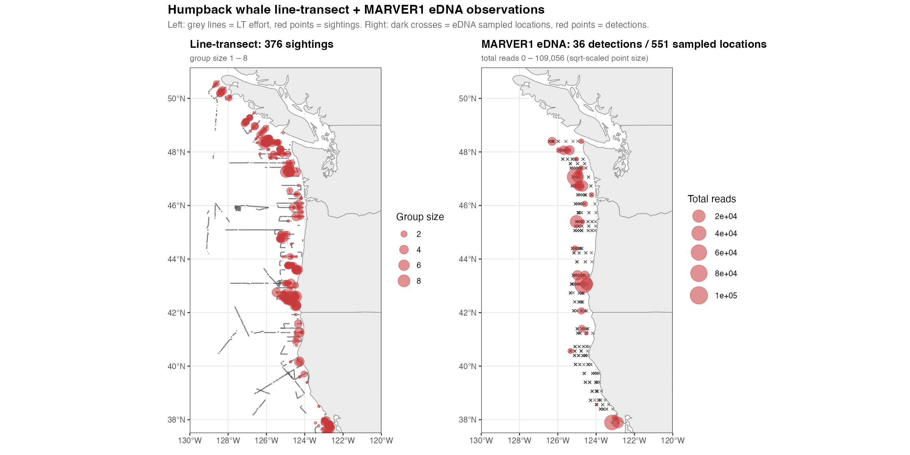
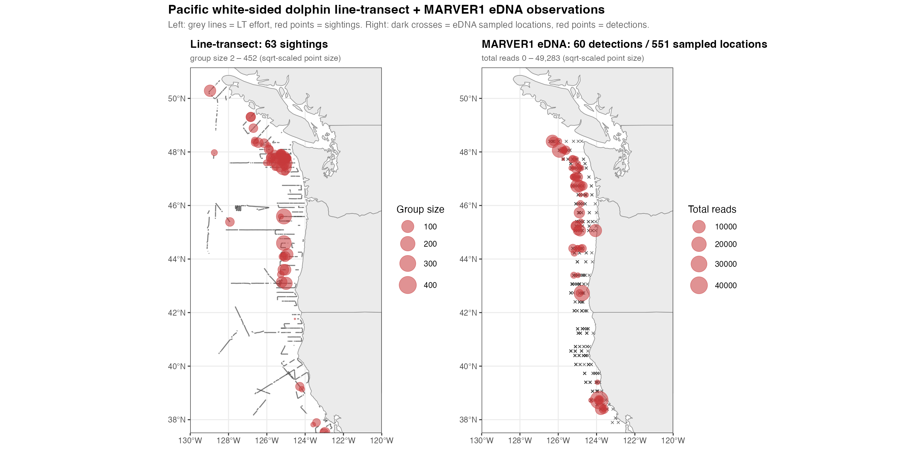

```{r setup, include=FALSE}
knitr::opts_chunk$set(
  echo      = FALSE,
  message   = FALSE,
  warning   = FALSE,
  fig.align = "center",
  dpi       = 110
)
```

## GitHub Repo

<https://github.com/MMARINeDNA/eDNAVisualJointModel/>

## Why joint modelling?

For the same species, in the same area, two complementary survey streams:

::: {.fragment}
- **Line-transect** — visual sightings in 2018
:::

::: {.fragment}
- **eDNA** — qPCR + MARVER1 metabarcoding in 2019
:::

::: {.fragment}
**Joint fit**: a single latent density surface drives both observation processes.
:::

## State-space view of the joint model

```{mermaid}
%%| fig-align: center
flowchart TB
  L["<b>Latent density surface</b><br/>log λ(x, y, z) = μ + f(x, y, z)<br/>f ~ GP(0, K)"]
  L --> E["<b>eDNA observations</b><br/>qPCR Ct + MARVER1 reads"]
  L --> V["<b>Visual observations</b><br/>line-transect sightings"]

  classDef latent fill:#fff5d6,stroke:#b08000,stroke-width:1.5px,color:#222;
  classDef obs    fill:#e0f0ff,stroke:#3a6ea5,stroke-width:1.5px,color:#222;
  class L latent;
  class E,V obs;
```

## Latent density: GP submodel

$$
\log \lambda_s(\mathbf{x}) \;=\; \mu_s \;+\; f_s(\mathbf{x}),
\qquad
f_s \sim \mathcal{GP}\!\bigl(0,\, K(\ell_x, \ell_y, \ell_z)\bigr)
$$

::: {.fragment}
- 3-D anisotropic squared-exponential kernel.
- Fit via the **HSGP approximation** — basis expansion of size $M \ll N$.
- Independent length-scales per species.
:::

## eDNA observation submodel

Per-litre target copy concentration:

$$
\mathbb{E}[\text{copies}_{i,s}] \;=\; c_s \cdot \lambda_s(\mathbf{x}_i) \cdot \zeta(\mathbf{x}_i) \cdot v_i
$$

::: {.fragment}
- **qPCR**: hurdle on Ct values via standard curve.
- **Metabarcoding**: zero-inflated Beta-Binomial across target species + junk.
:::

## Line-transect observation submodel

Per-segment encounter-rate Poisson:

$$
n_j \;\sim\; \text{Poisson}\!\bigl(2\, L_j\, \mathrm{ESW}_s\, \lambda_s^{(g)}(\mathbf{x}_j)\bigr)
$$

::: {.fragment}
- Half-normal detection $g_s(d)$; PWSD's $\sigma$ depends on group size.
- Population-average ESW + size-bias correction.
:::

## Per-species data: humpback whale

{.r-stretch fig-alt="Line-transect (left) and MARVER1 eDNA (right) observations for humpback whale."}

## Per-species data: PWSD

{.r-stretch fig-alt="Line-transect (left) and MARVER1 eDNA (right) observations for Pacific white-sided dolphin."}

## Project Goals

::: {.incremental}
- **Density estimates** with uncertainty from both observation streams.
- **Calibration** of the eDNA → animals link from the LT side.
- **Coverage** from eDNA where transects don't reach and vice versa.
- **Shared latent field** for principled extrapolation and ecological inference.
:::

## Morning Objectives
::: {.incremental}
- Scope and goals of the M3 integrated spatial model (EKJ)
- qPCR and metabarcoding observational submodel (AOS)
- Visual line-transect observational submodel (LT)
- Spatial process model and estimation (EKJ)
- Simulation, progress and next steps (EKJ)
:::

## References

::: {.smaller}
- Riutort-Mayol *et al.* (2023). *Practical Hilbert space approximate Bayesian Gaussian processes for probabilistic programming.* Stat. Comp. 33:17.
- Buckland *et al.* (2001, 2015). *Distance Sampling.*
:::
